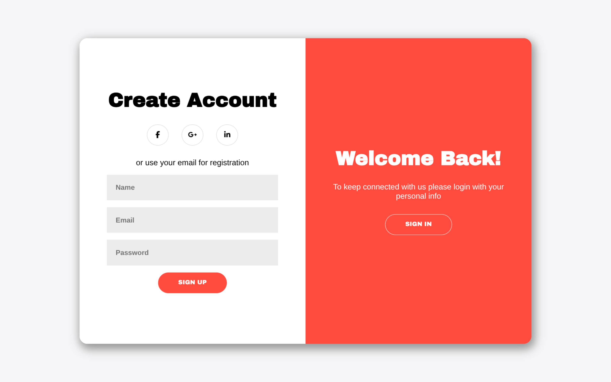
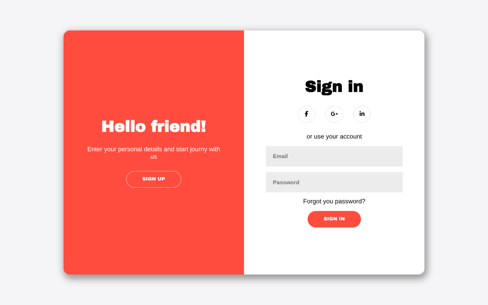

# Sign In/Up Form

A sign in/up form with a sliding panel transition between the login and
registration views. Built with HTML, CSS, and JavaScript.

## Screenshots

## Features

- Toggle between Sign In and Sign Up with a sliding panel transition
- Sign Up form: Name, Email, Password fields
- Sign In form: Email, Password fields
- Social login icons (Facebook, Google, LinkedIn) — UI only
- "Forgot your password?" link
- Form validation

## Tech Stack

- HTML5
- CSS3
- JavaScript

> **Note:** This project is built for desktop screens only. It has no responsive styles (no media queries), so the layout will not adapt to phones or tablets. My focus was on implementing the core idea rather than the visual design.
